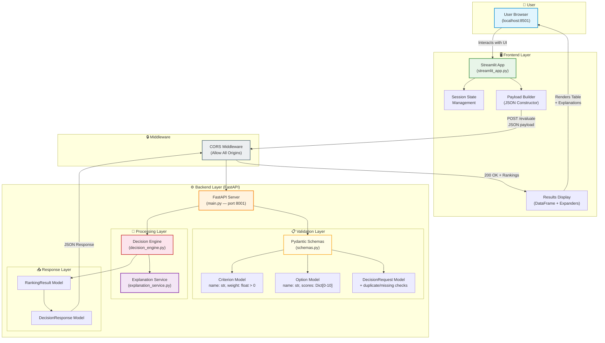
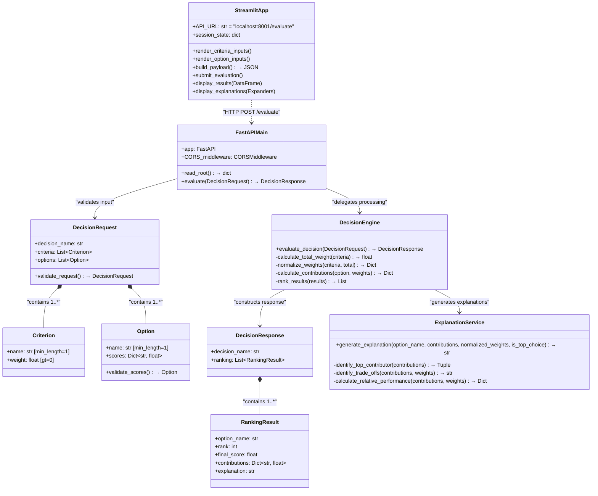

# 📐 Decision Companion System — Design Diagrams

> **Project:** Decision Companion System  
> **Author:** Baiju  
> **Architecture Style:** Client-Server (Streamlit + FastAPI)  
> **Core Algorithm:** Weighted Multi-Criteria Decision Making (WMCDM)

---

## 1. 🏗️ Architecture Diagram

This diagram provides a high-level overview of the entire system, showing how the **Streamlit Frontend**, **FastAPI Backend**, and internal service layers interact.

---

## 2. 🔀 Data Flow Diagram (DFD)

This diagram traces how **data transforms** at each stage — from raw user input through validation, normalization, scoring, explanation generation, and final rendering.

```mermaid
flowchart LR
    subgraph "📥 INPUT STAGE"
        A["🧑 User Input"] -->|"Decision Name<br/>Criteria Names + Weights<br/>Option Names + Scores"| B["📝 Streamlit Form<br/>(Session State)"]
    end

    subgraph "📦 PAYLOAD CONSTRUCTION"
        B -->|"Constructs JSON"| C["📤 DecisionRequest<br/>{decision_name,<br/>criteria: [{name, weight}],<br/>options: [{name, scores}]}"]
    end

    subgraph "✅ VALIDATION STAGE"
        C -->|"HTTP POST"| D["🔍 Pydantic Validation"]
        D -->|"Check 1"| D1["weights > 0?"]
        D -->|"Check 2"| D2["scores in 0-10?"]
        D -->|"Check 3"| D3["no duplicate criteria?"]
        D -->|"Check 4"| D4["all scores present?"]
        D1 & D2 & D3 & D4 -->|"✅ All Pass"| E["Validated Request"]
    end

    subgraph "🧮 PROCESSING STAGE"
        E --> F["⚖️ Weight Normalization<br/>norm_weight = weight / Σweights"]
        F --> G["📊 Score Calculation<br/>contribution = norm_weight × score<br/>final_score = Σcontributions"]
        G --> H["🏆 Ranking<br/>Sort by final_score DESC"]
    end

    subgraph "💡 EXPLANATION STAGE"
        H --> I["🔎 Identify Top Contributor<br/>(highest contribution)"]
        I --> J["📉 Identify Trade-offs<br/>(ratio < 0.7 of max possible)"]
        J --> K["📝 Generate Text<br/>(Rule-Based Explanation)"]
    end

    subgraph "📤 OUTPUT STAGE"
        K --> L["📊 DecisionResponse<br/>{decision_name,<br/>ranking: [{rank, score,<br/>contributions, explanation}]}"]
        L -->|"JSON Response"| M["📋 Streamlit Table<br/>+ Expandable Explanations"]
        M --> N["🧑 User Views Results"]
    end

    style A fill:#e3f2fd,stroke:#1565c0,stroke-width:2px
    style D fill:#fff8e1,stroke:#ff8f00,stroke-width:2px
    style F fill:#fce4ec,stroke:#c62828,stroke-width:2px
    style G fill:#fce4ec,stroke:#c62828,stroke-width:2px
    style H fill:#fce4ec,stroke:#c62828,stroke-width:2px
    style I fill:#f3e5f5,stroke:#7b1fa2,stroke-width:2px
    style J fill:#f3e5f5,stroke:#7b1fa2,stroke-width:2px
    style K fill:#f3e5f5,stroke:#7b1fa2,stroke-width:2px
    style M fill:#e8f5e9,stroke:#2e7d32,stroke-width:2px
    style N fill:#e3f2fd,stroke:#1565c0,stroke-width:2px
```

---

## 3. 🧩 Component Diagram

This diagram shows the **internal module structure** of the codebase, class definitions, and dependency relationships between components.

---

## 4. 🧠 Decision Logic Diagram (Flowchart)

This diagram illustrates the **complete algorithmic flow** of the WMCDM decision engine — from input reception to final ranked output with explanations.

```mermaid
flowchart TD
    START(["🚀 START: User clicks Evaluate Decision"]) --> V1

    subgraph "🔒 Frontend Validation"
        V1{"Decision name<br/>provided?"}
        V1 -->|"❌ No"| ERR1["⚠️ Show: Please enter<br/>a decision name"]
        V1 -->|"✅ Yes"| V2{"At least 1 valid<br/>criterion?"}
        V2 -->|"❌ No"| ERR2["⚠️ Show: Please add<br/>at least one criterion"]
        V2 -->|"✅ Yes"| V3{"All options have<br/>names?"}
        V3 -->|"❌ No"| ERR3["⚠️ Show: Please add<br/>valid option names"]
        V3 -->|"✅ Yes"| BUILD
    end

    BUILD["📦 Build JSON Payload"] --> SEND

    SEND["📡 POST to FastAPI<br/>/evaluate endpoint"] --> BACKEND

    subgraph "🔒 Backend Validation (Pydantic)"
        BACKEND{"Pydantic<br/>validation"}
        BACKEND -->|"❌ weight ≤ 0"| ERR4["422: Weight must be > 0"]
        BACKEND -->|"❌ score not 0-10"| ERR5["422: Score out of range"]
        BACKEND -->|"❌ duplicates"| ERR6["400: Duplicate criteria"]
        BACKEND -->|"❌ missing scores"| ERR7["400: Missing scores for option"]
        BACKEND -->|"✅ Valid"| CALC
    end

    subgraph "🧮 WMCDM Calculation"
        CALC["Calculate total_weight =<br/>Σ(all criterion weights)"]
        CALC --> NORM["For each criterion:<br/>norm_weight = weight / total_weight"]
        NORM --> LOOP["For each option:"]
        LOOP --> CONTRIB["For each criterion:<br/>contribution = norm_weight × score"]
        CONTRIB --> SUM["final_score =<br/>Σ(all contributions)"]
        SUM --> ROUND["Round to 4 decimal places"]
    end

    ROUND --> RANK

    subgraph "🏆 Ranking"
        RANK["Sort all options by<br/>final_score DESCENDING"]
        RANK --> ASSIGN["Assign rank numbers<br/>(1, 2, 3, ...)"]
    end

    ASSIGN --> EXPLAIN

    subgraph "💡 Explanation Generation"
        EXPLAIN["For each ranked option:"]
        EXPLAIN --> TOP["Find TOP contributor<br/>(highest contribution value)"]
        TOP --> ALIGN{"Top contributor =<br/>highest weighted<br/>criterion?"}
        ALIGN -->|"✅ Yes"| ALIGNED["Add: Highly aligned with<br/>most important criterion"]
        ALIGN -->|"❌ No"| SKIP1["Skip alignment note"]
        ALIGNED --> TRADE
        SKIP1 --> TRADE
        TRADE["Calculate relative performance<br/>ratio = contribution / (norm_weight × 10)"]
        TRADE --> WEAK{"Any criterion<br/>ratio < 0.7?"}
        WEAK -->|"✅ Yes"| TRADEOFF["Add: Notable trade-off<br/>in weakest criterion"]
        WEAK -->|"❌ No"| SKIP2["No trade-off mentioned"]
        TRADEOFF --> COMBINE
        SKIP2 --> COMBINE
        COMBINE["Combine explanation parts"]
    end

    COMBINE --> RESPONSE

    RESPONSE["📤 Build DecisionResponse<br/>{decision_name, ranking}"] --> RETURN

    RETURN["Return JSON to Frontend"] --> DISPLAY

    subgraph "📊 Frontend Display"
        DISPLAY["Parse JSON Response"]
        DISPLAY --> TABLE["Render DataFrame Table<br/>(Rank | Option | Score | Contributions)"]
        TABLE --> EXPANDER["Render Expandable<br/>Explanation Cards"]
        EXPANDER --> DONE(["✅ DONE: User views results"])
    end

    style START fill:#c8e6c9,stroke:#2e7d32,stroke-width:3px
    style DONE fill:#c8e6c9,stroke:#2e7d32,stroke-width:3px
    style ERR1 fill:#ffcdd2,stroke:#c62828,stroke-width:2px
    style ERR2 fill:#ffcdd2,stroke:#c62828,stroke-width:2px
    style ERR3 fill:#ffcdd2,stroke:#c62828,stroke-width:2px
    style ERR4 fill:#ffcdd2,stroke:#c62828,stroke-width:2px
    style ERR5 fill:#ffcdd2,stroke:#c62828,stroke-width:2px
    style ERR6 fill:#ffcdd2,stroke:#c62828,stroke-width:2px
    style ERR7 fill:#ffcdd2,stroke:#c62828,stroke-width:2px
    style CALC fill:#e3f2fd,stroke:#1565c0,stroke-width:2px
    style NORM fill:#e3f2fd,stroke:#1565c0,stroke-width:2px
    style SUM fill:#e3f2fd,stroke:#1565c0,stroke-width:2px
    style RANK fill:#fff8e1,stroke:#f57c00,stroke-width:2px
    style EXPLAIN fill:#f3e5f5,stroke:#7b1fa2,stroke-width:2px
    style TABLE fill:#e8f5e9,stroke:#388e3c,stroke-width:2px
```

---

## 📊 Summary Table

| Diagram | Purpose | Key Insight |
|---------|---------|-------------|
| **Architecture** | Bird's eye system overview | Shows clean separation: Frontend → Middleware → API → Services |
| **Data Flow** | Traces data transformation | Maps the journey from raw input to final scored + explained output |
| **Component** | Module structure & dependencies | Highlights class relationships and the modular OOP design |
| **Decision Logic** | Algorithmic flowchart | Details every validation check, math step, and branching logic |

---

## 🔑 Key Design Decisions

1. **No AI for Scoring** — The WMCDM engine is purely mathematical (deterministic), ensuring transparency and explainability.
2. **Rule-Based Explanations** — Trade-offs are flagged only when a criterion's relative performance drops below 70% of its maximum potential contribution.
3. **Dynamic Inputs** — Both criteria and options can be added/removed in real-time via Streamlit session state.
4. **Layered Validation** — Input is validated twice: once on the frontend (basic checks) and once on the backend (Pydantic schema enforcement).
5. **Decoupled Architecture** — Frontend and backend communicate via REST API, allowing independent deployment and scaling.
